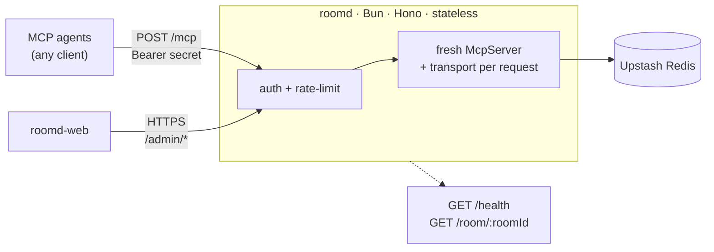

# roomd architecture

Canonical architecture notes for the reference implementation. Prefer this
document (and the whitepaper §6–8) over older Excalidraw sketches.

## Request path

## Auth model

Three bearer types resolve to a `teamId`:

1. Static `API_KEYS` env map
2. Dynamic keys in Redis (`dynkey:{sha256}`)
3. Room-scoped invites (`invite:{sha256}`)

First team to touch a `roomId` claims ownership (`room:{roomId}:owner` NX).
Invites skip the claim and are limited to one room.

## Tools

25 MCP tools across plan, context, events, presence, locks, and shared vars.
See `src/mcp/server.ts` and the whitepaper Table 1.

## Stale diagram

`docs/roomd-architecture.excalidraw.historical` described an early prototype
(8 tools, single `ROOMD_SECRET`, SSE). Historical only; do not treat it as current.
